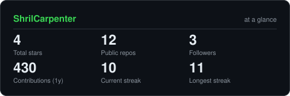
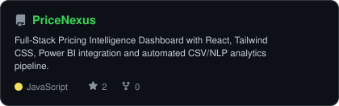
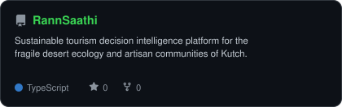
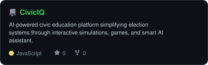
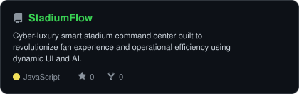

<div align="center">

<!-- PORTRAIT - generated by scripts/dotify.py from assets/me.png.
     Colour mode, so one file serves both GitHub themes. Regenerate with:
       python scripts/dotify.py assets/me.png -o assets/portrait \
         --cols 100 --equalize --detail 0.5 --color -->


<br>

<!-- NAME / TAGLINE - animated typing -->
<a href="https://github.com/ShrilCarpenter">
  
</a>

<br>

<!-- SOCIALS -->
<a href="https://linkedin.com/in/shrilcarpenter"></a>
<a href="mailto:shrilcarpenter@gmail.com"></a>
<a href="https://leetcode.com/u/ShrilCarpenter"></a>
<a href="https://github.com/ShrilCarpenter"></a>


</div>

---

## `~/` whoami

```console
$ cat about.txt
```

Hi, I'm **Shril Carpenter**. I'm an Information Technology undergraduate specializing in **Data Science & Analytics**, passionate about building intelligent machine learning systems, data-driven platforms, and interactive applications.

- Currently building **[PriceNexus](https://github.com/ShrilCarpenter/PriceNexus)** and **[CivicIQ](https://github.com/ShrilCarpenter/CivicIQ)**
- Exploring **Predictive Modeling, NLP Pipelines & Intelligent Automation**
- Practicing **[LeetCode](https://leetcode.com/u/ShrilCarpenter)** algorithmic problem solving
- Fun fact: **I love transforming complex, unstructured data into intuitive visual insights and real-world tools.**

<br>

<div align="center">

## `~/` toolbox


</div>

---

<div align="center">

## `~/` skill radar

<table>
<tr>
<td width="50%" align="center" valign="middle">

<!-- Self-rated radar - edit assets/skills.json, the workflow redraws it -->
<picture>
  <source media="(prefers-color-scheme: dark)"  srcset="assets/radar-dark.svg">
  <source media="(prefers-color-scheme: light)" srcset="assets/radar-light.svg">
  
</picture>

</td>
<td width="50%" align="center" valign="middle">

<!-- Live radar built from real language byte counts across your repos -->
<picture>
  <source media="(prefers-color-scheme: dark)"  srcset="assets/radar-langs-dark.svg">
  <source media="(prefers-color-scheme: light)" srcset="assets/radar-langs-light.svg">
  
</picture>

</td>
</tr>
</table>

</div>

---

<div align="center">

## `~/` contribution calendar

<!-- 3D isometric calendar, regenerated every 6h by .github/workflows/metrics.yml -->


<br><br>

<!-- Snake eats the contribution graph - .github/workflows/snake.yml -->
<picture>
  <source media="(prefers-color-scheme: dark)"  srcset="https://raw.githubusercontent.com/ShrilCarpenter/ShrilCarpenter/output/snake-dark.svg">
  <source media="(prefers-color-scheme: light)" srcset="https://raw.githubusercontent.com/ShrilCarpenter/ShrilCarpenter/output/snake.svg">
  
</picture>

</div>

---

<div align="center">

## `~/` the numbers

<!-- Generated by scripts/cards.py into this repo. Static files so they never 503 -->
<picture>
  <source media="(prefers-color-scheme: dark)"  srcset="assets/card-stats-dark.svg">
  <source media="(prefers-color-scheme: light)" srcset="assets/card-stats-light.svg">
  
</picture>

<br>


<br><br>


</div>

---

<div align="center">

## `~/` selected work

<!-- Cards generated by scripts/cards.py from assets/projects.json.
     Stars, forks and language are pulled live from the API on every run. -->
<table>
<tr>
<td width="50%">
  <a href="https://github.com/ShrilCarpenter/PriceNexus">
    <picture>
      <source media="(prefers-color-scheme: dark)"  srcset="assets/card-PriceNexus-dark.svg">
      <source media="(prefers-color-scheme: light)" srcset="assets/card-PriceNexus-light.svg">
      
    </picture>
  </a>
</td>
<td width="50%">
  <a href="https://github.com/ShrilCarpenter/RannSaathi">
    <picture>
      <source media="(prefers-color-scheme: dark)"  srcset="assets/card-RannSaathi-dark.svg">
      <source media="(prefers-color-scheme: light)" srcset="assets/card-RannSaathi-light.svg">
      
    </picture>
  </a>
</td>
</tr>
<tr>
<td width="50%">
  <a href="https://github.com/ShrilCarpenter/CivicIQ">
    <picture>
      <source media="(prefers-color-scheme: dark)"  srcset="assets/card-CivicIQ-dark.svg">
      <source media="(prefers-color-scheme: light)" srcset="assets/card-CivicIQ-light.svg">
      
    </picture>
  </a>
</td>
<td width="50%">
  <a href="https://github.com/ShrilCarpenter/StadiumFlow">
    <picture>
      <source media="(prefers-color-scheme: dark)"  srcset="assets/card-StadiumFlow-dark.svg">
      <source media="(prefers-color-scheme: light)" srcset="assets/card-StadiumFlow-light.svg">
      
    </picture>
  </a>
</td>
</tr>
</table>

<sub>

| project | repository | stack |
|---|---|---|
| **[PriceNexus](https://github.com/ShrilCarpenter/PriceNexus)** | [github.com/ShrilCarpenter/PriceNexus](https://github.com/ShrilCarpenter/PriceNexus) | `React` `Tailwind CSS` `NLP` `Power BI` |
| **[RannSaathi](https://github.com/ShrilCarpenter/RannSaathi)** | [github.com/ShrilCarpenter/RannSaathi](https://github.com/ShrilCarpenter/RannSaathi) | `TypeScript` `React` `Decision Intelligence` |
| **[CivicIQ](https://github.com/ShrilCarpenter/CivicIQ)** | [github.com/ShrilCarpenter/CivicIQ](https://github.com/ShrilCarpenter/CivicIQ) | `JavaScript` `AI Assistant` `Interactive UI` |
| **[StadiumFlow](https://github.com/ShrilCarpenter/StadiumFlow)** | [github.com/ShrilCarpenter/StadiumFlow](https://github.com/ShrilCarpenter/StadiumFlow) | `JavaScript` `Real-Time UI` `Command Center` |

</sub>

</div>

---

<div align="center">

<sub>`01110100 01101000 01100001 01101110 01101011 01110011 00100000 01100110 01101111 01110010 00100000 01110011 01100011 01110010 01101111 01101100 01101100 01101001 01101110 01100111`</sub>

</div>
